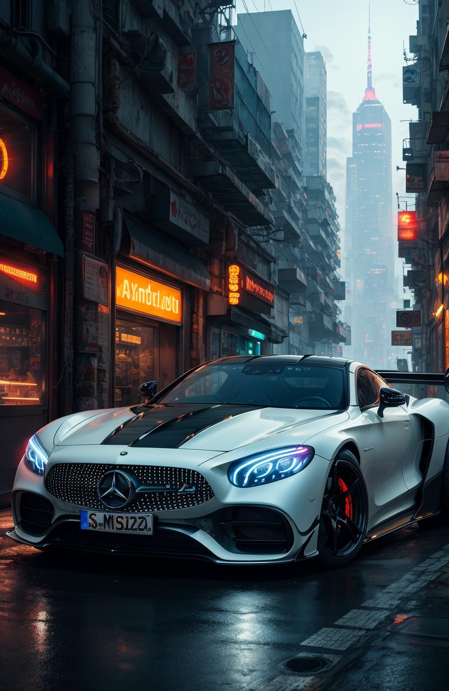
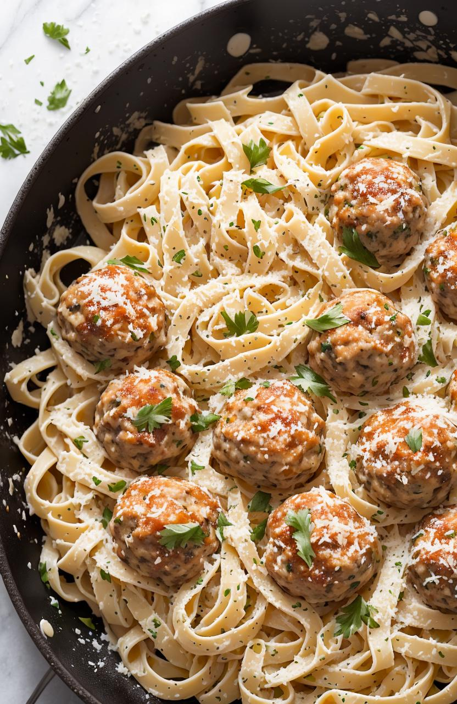
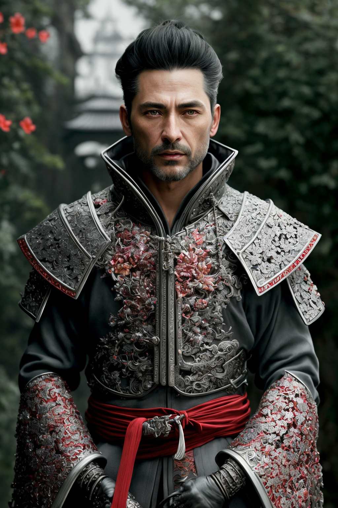
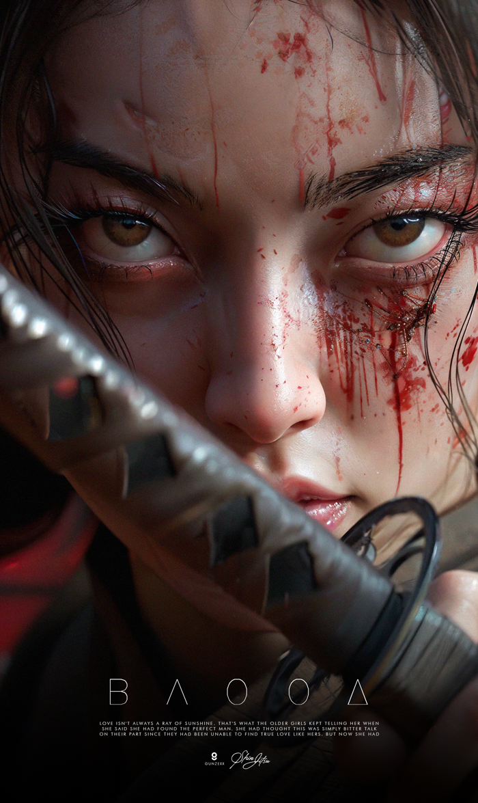
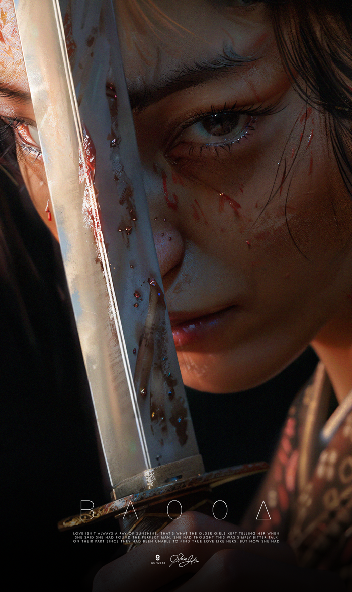
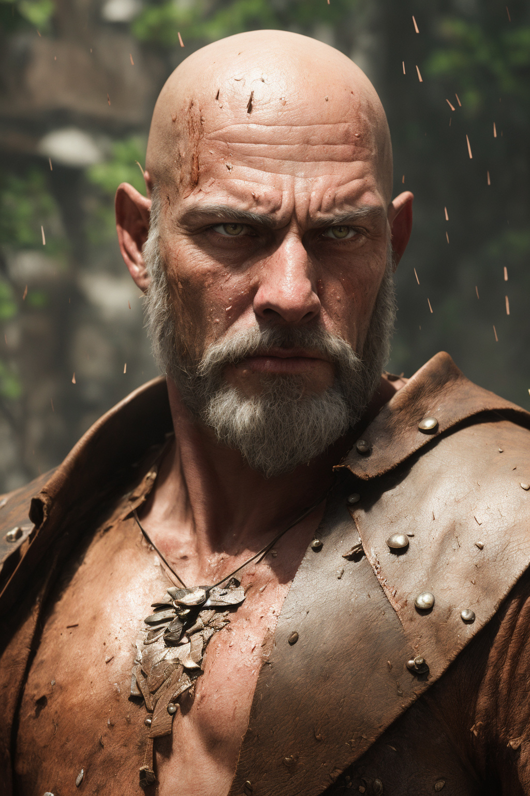

  

# How to Use

[Click here](https://scribehow.com/shared/How_to_Run_Stable_Diffusion_Using_Gradio_on_Colab__UpaS07PKTdipPoPOPTYF8g) to see the tutorial.

## Picture Examples

## Picture Examples

Here are some stunning picture examples generated using Stable Diffusion:

| Picture 1 | Picture 2 | Picture 3 |
| --- | --- | --- |
|  |  |  |
| *Mercedes car with vibrant colors.* | *Artistic food with intricate details.* | *Dreamy still life composition.* |

| Picture 4 | Picture 5 | Picture 6 |
| --- | --- | --- |
|  |  |  |
| *Captivating abstract artwork.* | *Hyper-realistic digital painting.* | *clear face illustration.* |

Feel free to explore the repository to generate your own amazing images! Don't forget to share your creations with the community.
